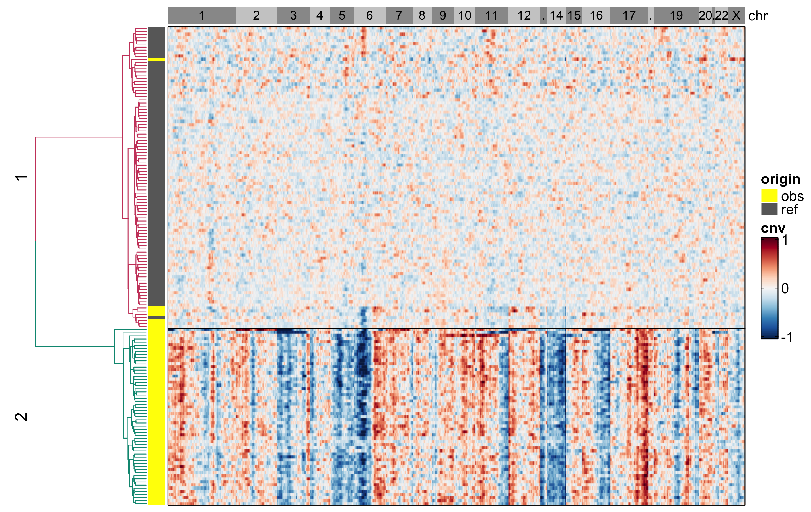

# infercnvPlus
### Desciption
Enhanced "infercnv" package.

### Input

**Expression data:** 10X counts data or Smart-seq2 TPM values.
|       | CCCTCCTAGCAGCGTA | GTCTCGTCATCCTTGC | TCAGATGGTCATTAGC | ATTCTACCATCTATGG | GACGTGCGTAGCTGCC |
|  ----  | ----  | ----  | ----  | ----  | ----  |
| AL627309.1 | 0 | 0 | 0 | 0 | 0 |
| AL669831.5 | 0 | 0 | 2 | 0 | 0 |
| LINC00115  | 1 | 0 | 0 | 0 | 0 |
|   FAM41C   | 0 | 0 | 0 | 0 | 0 |
|   NOC2L    | 1 | 0 | 0 | 1 | 0 |

**genomic_pos：** genomic coordinates for genes.
|     | CHR | START | STOP | 
|  ----  |  ----  |  ----  |  ----  |
| RP11-34P13.3 | 1 | 29554 | 31109  |
| FAM138A      | 1 | 34554 | 36081  |
| OR4F5        | 1 | 69091 | 70008  |
| RP11-34P13.7 | 1 | 89295 | 133723 |
| RP11-34P13.8 | 1 | 89551 | 91105  |


### Usage

Run infercnvPlus using built-in data
```R
library(infercnvPlus)

# Run example with built-in data
data(expr, genomic_pos, ref_obs, package = "infercnvPlus")

# Data tranforming: genes(rows) X cells(columns)
## For 10X counts data 
expr_tr <- umi_to_log2tpm(expr)

## For Smart-seq2 TPM values
expr_tr <- log2(expr + 1)

# Calucate cnv score
cnv_obj <- inferCNV(data = expr_tr,
                    gene_pos = genomic_pos,
                    cutoff = 0.1, # use 1 for smart-seq, 0.1 for 10x-genomics
                    reference_obs = ref_obs,
                    window_size = 101,
                    out_path = "output_dir", # dir is auto-created for storing outputs
                    noise_filter = NULL,
                    vis_bounds = "-1,1")

# Cluster cells and visualize
cnv_obj <- visualCNV(data = cnv_obj,
                     cutree_k = 2,
                     out_file = "plot_cnv.png")

# Extract cells from the specific subtrees
cnv_obj <- extractCells(data = cnv_obj,
                        subtrees = 2,
                        lab_to_rm = "ref")

# Get cell barcode
cells <- cnv_obj$target
```

Output figure


### FAQ

How to generate a genomic positions file from a GTF file?
```R
genomic_pos <- gtf_to_position(gtf = "path/to/gtf", out_file = "genomic_positions.txt", out_path = "./")
```

How to convert a Seurat(v3) object to matrix for inferCNV?
```R
expr_tr <- importSrat(obj, slot = "counts", assay = "RNA", log2tpm_tr = TRUE)
```